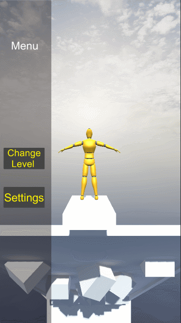

 
    <h1>WreckedDoll</h1>
     

# Description

### [Ru]
  
Этот проект был создан еще в 2022г на курсах с в команде из 3х разработчиков.
В тот момент нас просто кинули что-то делать по пунктам из гдд. Ни о какой архитектуре еще никто и не знал.
Из-за отсутствия ментора, который бы наставлял нас на путь правильного кода, получилось то что получилось. 

### [En]

This project was created back in 2022 on courses with a team of 3 developers.
At that moment, we were simply thrown to do something according to the points from the GDD. Nobody knew about any architecture yet.
Due to the lack of a mentor who would guide us on the path to the right code, what happened happened.

# Video

### Options in the menu:
  

 
    
 

